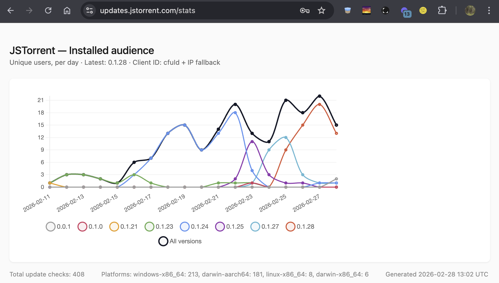

# simple-app-update-server

A lightweight, self-hosted update server for desktop and mobile apps. Polls GitHub Releases, caches results, and serves version checks over HTTP.



## How it works

The server polls GitHub Releases for configured products and caches the results. Clients check for updates via HTTP and receive either a `204 No Content` (up to date) or a JSON payload with the new version, release notes, and download URLs.

Two update protocols are supported:

- **Tauri updater** (`/tauri/:target/:arch/:currentVersion`) — returns the platform-specific binary URL and signature expected by Tauri's built-in updater.
- **Simple version check** (`/version` or `/version/:currentVersion`) — returns version + release notes JSON, suitable for any app.
- **Signed artifact manifest** (`/manifest/:arch/:currentVersion`) — returns an exact release manifest and detached signature as base64. The server routes metadata, while the native client authenticates the manifest with its embedded key.

Products are routed by hostname, so a single instance serves multiple apps. Products sharing a hostname can be differentiated by path prefix.

## Endpoints

| Route | Description |
|---|---|
| `GET /health` | Health check (`{ "ok": true }`) |
| `GET /tauri/:target/:arch/:version` | Tauri update check (204 or update JSON) |
| `GET /version` | Latest version info |
| `GET /version/:currentVersion` | Version check with analytics (204 or update JSON) |
| `GET /manifest[/:currentVersion]` | Latest signed artifact-manifest envelope |
| `GET /manifest/:arch/:currentVersion` | Architecture-aware manifest check with analytics |
| `GET /stats` | Per-product analytics dashboard |

## Configuration

All configuration is via environment variables:

| Variable | Default | Description |
|---|---|---|
| `PORT` | `3100` | Server listen port |
| `GITHUB_TOKEN` | _(none)_ | GitHub token for API requests (recommended to avoid rate limits) |
| `LOG_DIR` | `./logs` | Directory for analytics logs and caches |
| `DEFAULT_PRODUCT` | _(none)_ | Fallback product ID when hostname doesn't match |
| `PRODUCTS_CONFIG` | `./products.json` | Path to a JSON file or directory of JSON files |

## Product Configuration

Products can be configured as a single JSON file or a directory of JSON files. Set `PRODUCTS_CONFIG` to point at either.

**Single file** (`products.json` — the default):
```bash
cp products.sample.json products.json
```

**Directory** (e.g. `products.d/`): each `.json` file contains one product object or an array. Files are loaded in alphabetical order. This lets each project repo own its own config file.

```bash
mkdir products.d
# Each repo contributes its own file:
# products.d/jstorrent.json
# products.d/yepanywhere.json
```

Each product has these fields:

| Field | Type | Description |
|---|---|---|
| `id` | string | Slug used in URLs, log filenames, and as the product identifier |
| `displayName` | string | Human-readable name shown on the stats dashboard |
| `hostnames` | string[] | Hostnames that route to this product (matched against `Host` / `X-Forwarded-Host`) |
| `githubRepo` | string | GitHub `owner/repo` to fetch releases from |
| `tagPrefix` | string | Release tag prefix to filter (e.g. `v`, `tauri-app-v`) |
| `tauriUpdates` | boolean | Whether this product serves Tauri updater responses (`/tauri` endpoint) |
| `pathPrefix` | string? | Optional path prefix for products sharing a hostname (e.g. `"/bridge"`) |
| `artifactManifest` | object? | Exact `manifestAsset` and `signatureAsset` names for signed native releases |

Products sharing a hostname are differentiated by `pathPrefix`. Requests to `/bridge/version` route to the product with `pathPrefix: "/bridge"`, while `/version` routes to the one without a prefix.

The server will refuse to start if the config is missing or contains invalid data. `products.json` is gitignored since it's deployment-specific.

## Development

```bash
npm install
npm run dev       # start with tsx (auto-reloads)
npm test          # run tests
npm run check     # lint + typecheck + test
```

## Production

```bash
npm run build     # bundle with esbuild
npm start         # run bundled server
```

## Deployment with Caddy

Caddy is recommended as a reverse proxy — it handles TLS automatically and can protect the `/stats` endpoint with basic auth.

Generate a password hash:

```bash
caddy hash-password --plaintext 'your-password'
```

Example Caddyfile with `/stats` behind basic auth:

```caddyfile
(update-server) {
	reverse_proxy localhost:3100

	handle /stats {
		basicauth {
			admin $2a$14$... # output from caddy hash-password
		}
		reverse_proxy localhost:3100
	}
}

updates.my-app.com {
	import update-server
}
```

Caddy will automatically provision TLS certificates via Let's Encrypt. Update check endpoints (`/tauri/*`, `/version/*`) remain unauthenticated so apps can check freely, while `/stats` requires a login.

### Selectable update channels

Tauri products may opt into a channel registry:

```json
"channels": {
  "stable": {"displayName":"Stable","tagPrefix":"desktop-v","releaseKind":"release"},
  "latest": {"displayName":"Latest","tagPrefix":"desktop-latest-v","releaseKind":"prerelease"}
}
```

`GET <product>/channels` advertises schema version 1 and configured IDs/display
names. Update and version routes accept one `?channel=<id>`; omission preserves
Stable. Explicit empty, duplicate, malformed or unsupported channels return
400. Responses identify the channel with `X-Update-Channel`; Tauri candidates
also carry `channel` in JSON. Drafts are always excluded, and a channel selects
only its exact tag prefix and release kind. Numeric version ordering, rather
than publication time, determines the candidate. Tauri tag/metadata version
mismatches fail closed. Pagination preserves access to Stable after frequent
preview publication. New channel clients must discover support before using
Latest against independently deployed servers.

Stable retains its existing cache/notes files. Additional channels use separate
`channels/<id>/<encoded-release-rule>/` directories; they never inherit Stable
fallback. Removing a channel makes its explicit requests unavailable. Each
channel retains its last successful candidate across transient GitHub failures
and rejects regressing candidate versions. Analytics include channel identity.
The canary contract is maintained in desktop-release-kit's
`contract/desktop-update-channels-v1.md`.
